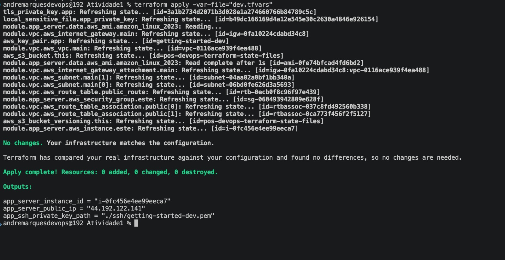
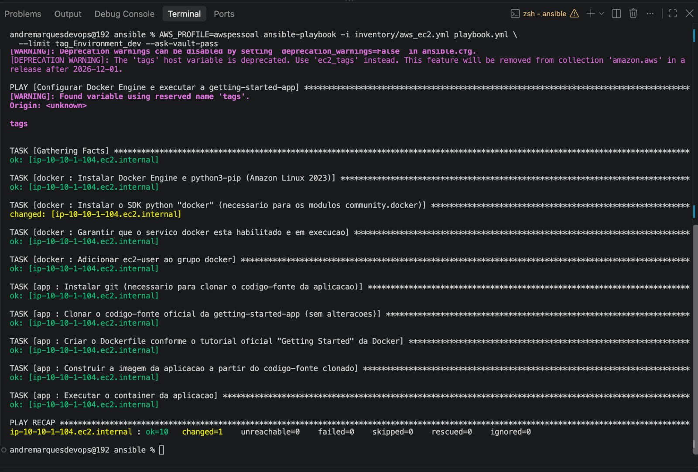
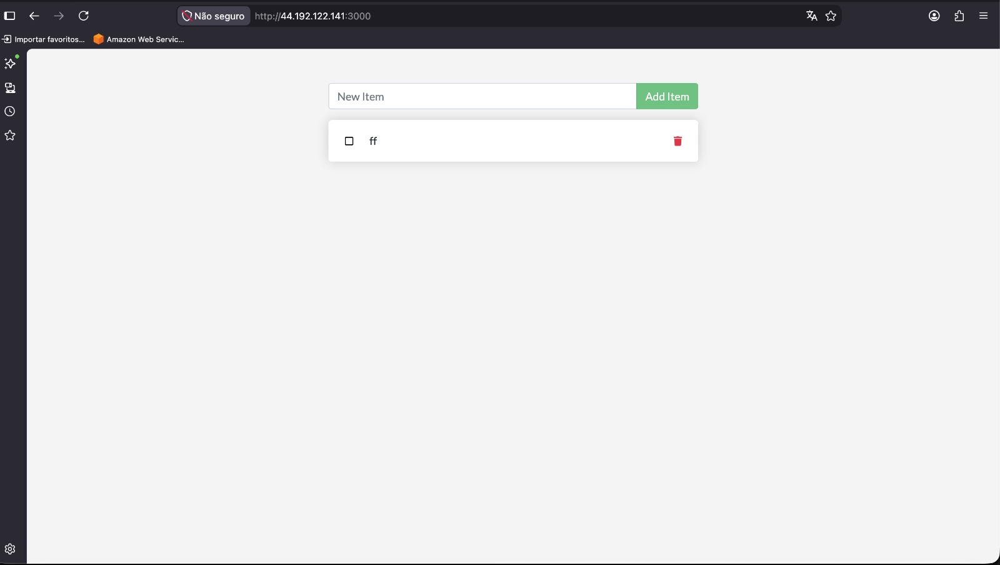
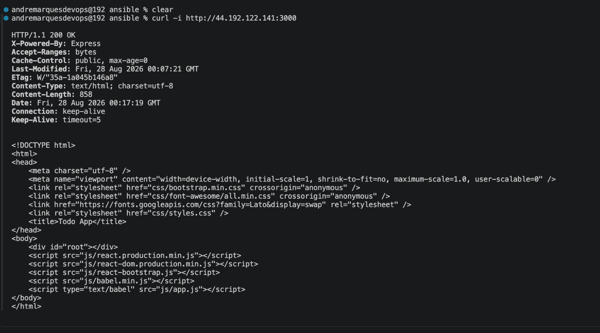
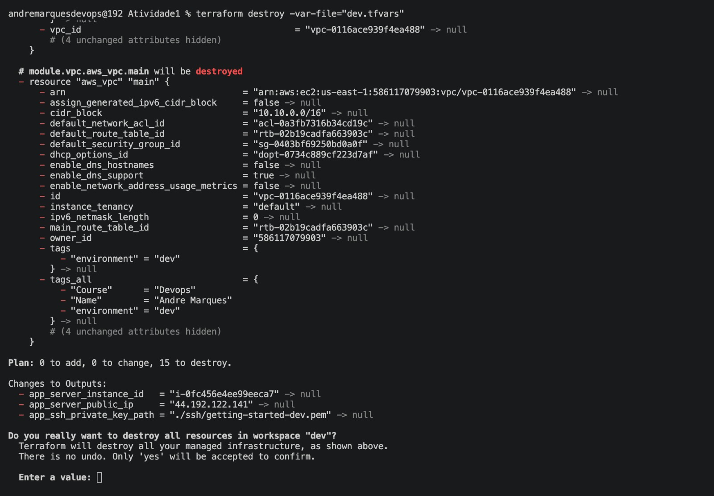
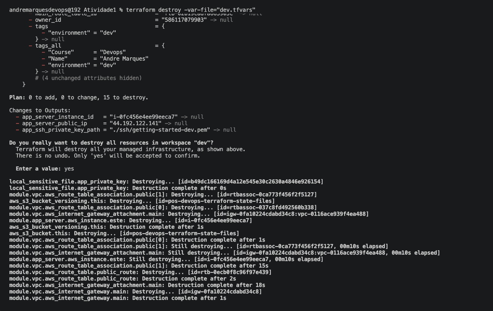

# Atividade 1 - IaC com Terraform

## Estrutura

```
.
├── backend.tf          # provider aws (+ tls, local) + backend s3 + bucket de state
├── main.tf              # modulo vpc, key pair SSH e modulo app_server (Atividade 3)
├── outputs.tf            # IP publico, instance id e caminho da chave SSH da instancia
├── variables.tf          # declaracao das variaveis (sem default; valores vem do tfvars)
├── dev.tfvars            # valores das variaveis para o ambiente dev
├── prod.tfvars           # valores das variaveis para o ambiente prod
├── ssh/                   # chaves privadas SSH geradas pelo Terraform (gitignorado)
├── modules/
│   ├── vpc/               # vpc, subnets, internet gateway, route table
│   ├── ec2/               # instancia EC2 generica (security group + user_data/key_name opcionais)
│   └── web/                # usa o modulo ec2 e injeta o user_data que instala o servidor web
└── ansible/               # configuracao da getting-started-app (ver secao "Atividade 3" abaixo)
    ├── ansible.cfg
    ├── requirements.yml
    ├── inventory/aws_ec2.yml
    ├── group_vars/all/    # vars.yml + vault.yml (criptografado)
    ├── roles/              # docker (instala Docker Engine) e app (build + run do container)
    └── playbook.yml
```

## Por que existe um `.tfvars` por ambiente

As variaveis em `variables.tf` não têm `default` de propósito — os valores reais ficam em um arquivo `.tfvars` por ambiente (ex: `dev.tfvars`). Isso porque o projeto usa **Terraform Workspaces** para isolar o state de cada ambiente (dev, homolog, prod, etc.) dentro do mesmo backend S3.

Cada workspace usa seu próprio `.tfvars` correspondente, então trocar de ambiente é só trocar de workspace **e** apontar para o `.tfvars` daquele ambiente — sem editar código, sem duplicar módulos.

## Como rodar

```bash
# inicializa o backend e os providers
terraform init

# cria (ou reaproveita) o workspace do ambiente
terraform workspace new dev   # ou: terraform workspace select dev

# planeja usando o tfvars do ambiente correspondente ao workspace
terraform plan -var-file="dev.tfvars"

# aplica
terraform apply -var-file="dev.tfvars"
```

Para um novo ambiente (ex: `prod`), o padrão é:

```bash
terraform workspace new prod
```

e criar um `prod.tfvars` com os valores daquele ambiente, mantendo o mesmo `.tf` para todos.

---

## Atividade 3 — Projeto Final: Provisionamento e Configuração Integrados (Terraform + Ansible)

Esta seção documenta a aplicação **getting-started-app** (to-do list oficial da Docker), provisionada pelo Terraform e configurada pelo Ansible neste mesmo repositório, reaproveitando os módulos `vpc` e `ec2` das seções acima.

### Arquitetura

```
Internet
  |
  v
[ Internet Gateway ]
  |
VPC (10.10.0.0/16 dev | 10.30.0.0/16 prod)
  |
Subnet publica (module.vpc.subnet_ids[0])
  |
Security Group (22, 3000)
  |
+---------------------------+
| EC2 t3.micro              | <-- provisionada pelo Terraform (module.app_server)
| - Docker Engine           | <-- instalado pelo Ansible (role docker)
| - getting-started-app     | <-- container executado pelo Ansible (role app)
|   (porta 3000)            |
+---------------------------+
        ^
        |
terraform apply --> inventario dinamico (amazon.aws.aws_ec2) --> ansible-playbook
```

### Divisão de responsabilidades

- **Terraform**: cria toda a infraestrutura — VPC, subnet, Internet Gateway, route table (`modules/vpc`), Security Group liberando `22` e `3000`, a instância EC2 `t3.micro` e o par de chaves SSH (`tls_private_key` + `aws_key_pair`, gerado 100% via código) — tudo em `main.tf`, módulo `app_server` (reaproveita `modules/ec2`). Nenhum `remote-exec`, nenhum passo manual no console AWS.
- **Ansible** (pasta `ansible/`): instala o Docker Engine, clona o código-fonte oficial de [`docker/getting-started-app`](https://github.com/docker/getting-started-app) (sem alterá-lo), cria o `Dockerfile` exatamente como no tutorial oficial "Getting Started" da Docker (o repositório não inclui um) e builda/sobe o container usando `community.docker.docker_image`/`docker_container` — nenhum `command`/`shell`, nenhum SSH manual.

### Integração Terraform → Ansible — Opção A (inventário dinâmico + execução manual)

O gatilho da integração é a **tag da instância**, não um arquivo estático:

1. `terraform apply` (em `main.tf`) cria a instância via `module "app_server"` e aplica as tags `Environment = terraform.workspace` e `Project = var.project_name` (`"getting-started"`). Também gera o par de chaves e salva a chave privada em `./ssh/getting-started-<workspace>.pem` (`local_sensitive_file`, fora do Git).
2. O arquivo `ansible/inventory/aws_ec2.yml` usa o plugin `amazon.aws.aws_ec2` para consultar a API da AWS em tempo real, filtrando por `tag:Project: getting-started` e `instance-state-name: running`, e agrupando por `tag:Environment` (`tag_Environment_dev` / `tag_Environment_prod`). Ele também monta `ansible_host` (IP público), `ansible_user` (`ec2-user`) e `ansible_ssh_private_key_file` (`../ssh/getting-started-<Environment>.pem`) automaticamente a partir dos metadados da instância — **nenhum IP é hardcoded**.

> Nota: o enunciado da atividade se refere a esse plugin como `amazon.aws.ec2_instance`, mas na collection `amazon.aws` o plugin de inventário dinâmico se chama, de fato, `amazon.aws.aws_ec2` (arquivo `aws_ec2.py`) — é o nome usado neste projeto.
3. Você mesmo roda `ansible-playbook` depois do `apply`, apontando para esse inventário e limitando ao ambiente desejado. O `playbook.yml` aplica as roles `docker` e `app`, nessa ordem.

Ou seja: **o que dispara o quê** — `terraform apply` não chama o Ansible sozinho; ele só entrega a instância já taggeada. Quem lê essas tags e decide para qual host conectar é o plugin de inventário dinâmico, no momento em que você executa `ansible-playbook`.

### Pré-requisitos locais

```bash
# Terraform >= 1.5, AWS CLI configurado com o profile "awspessoal"

# Ansible + dependências do plugin de inventário dinâmico da AWS
pip install ansible boto3 botocore

# Collections usadas pelos playbooks/inventário
ansible-galaxy collection install -r ansible/requirements.yml
```

### Passo a passo de execução (dev)

```bash
# 1) Terraform provisiona a infraestrutura
terraform init
terraform workspace new dev        # ou: terraform workspace select dev
terraform apply -var-file="dev.tfvars"

chmod 400 ssh/getting-started-dev.pem

# 2) Conferir que o inventario dinamico enxerga a instancia recem-criada
cd ansible
ansible-inventory -i inventory/aws_ec2.yml --graph

# 3) Proteger a variavel sensivel (senha de admin fake) com ansible-vault
#    (rodar uma unica vez; o arquivo group_vars/all/vault.yml passa a ficar
#    criptografado no repositorio)
ansible-vault encrypt group_vars/all/vault.yml

# 4) Rodar o playbook (instala Docker + sobe o container), limitado ao ambiente dev
ansible-playbook -i inventory/aws_ec2.yml playbook.yml \
  --limit tag_Environment_dev --ask-vault-pass

# 5) Provar idempotencia: rodar de novo, sem nenhuma mudanca
terraform apply -var-file="../dev.tfvars"     # -> "No changes."
ansible-playbook -i inventory/aws_ec2.yml playbook.yml \
  --limit tag_Environment_dev --ask-vault-pass  # -> changed=0
```

**Evidência de idempotência:**




Para `prod`, repita com `terraform workspace new prod`, `-var-file="prod.tfvars"` e `--limit tag_Environment_prod`.

### Variável sensível protegida com Ansible Vault

`ansible/group_vars/all/vault.yml` contém `vault_admin_password` (senha de admin fictícia da aplicação), criptografada com `ansible-vault`. `ansible/group_vars/all/vars.yml` referencia essa variável indiretamente (`admin_password: "{{ vault_admin_password }}"`) e a role `app` a injeta no container como variável de ambiente `ADMIN_PASSWORD`.

O arquivo `ansible/group_vars/all/vault.yml` já está criptografado neste repositório (`ansible-vault encrypt ansible/group_vars/all/vault.yml`). Para editar a senha, use `ansible-vault edit ansible/group_vars/all/vault.yml`.

### Evidências de funcionamento

```bash
terraform output app_server_public_ip
curl http://<IP_PUBLICO>:3000
```




### Destruição dos recursos

```bash
terraform destroy -var-file="dev.tfvars"
# repetir para prod, se aplicavel:
terraform workspace select prod
terraform destroy -var-file="prod.tfvars"
```



